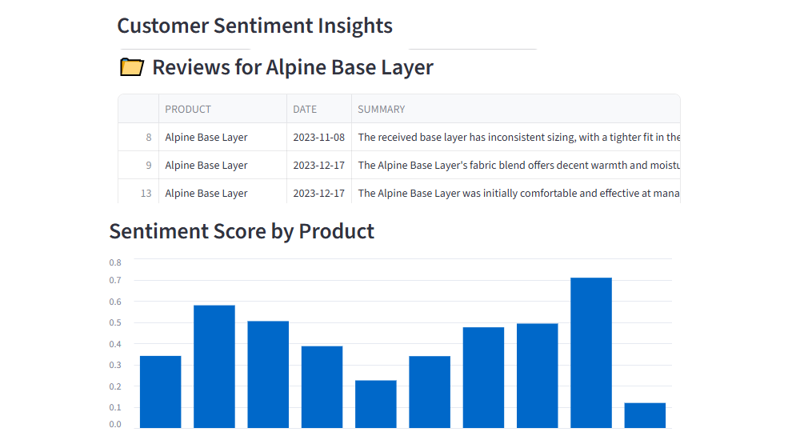

[](https://avalanche-lab.streamlit.app/)

# Avalanche — Customer Sentiment Insights

A tiny Streamlit app to explore customer review sentiment for **Avalanche, Inc.**
Load the sample CSV, clean and prep it, then visualize sentiment by product.

**Live app:** https://avalanche-lab.streamlit.app/



---

## Features
- Load reviews from a CSV (`customer_reviews.csv` included)
- Clean and normalize text
- Quick heuristic sentiment scoring (no API key required)
- Filter by product and view bar chart
- Runs locally or on Streamlit Community Cloud

---

## Quickstart (Local)

Requirements
- Python 3.10+
- `pip`

Run
```bash
# 1) clone or download
git clone https://github.com/jackiebiz/avalanche.git
cd avalanche

# 2) (optional) create & activate a virtual environment
python -m venv .venv
# PowerShell:
.\.venv\Scripts\Activate.ps1
# Git Bash:
# source .venv/Scripts/activate

# 3) install dependencies
pip install -r requirements.txt

# 4) start the app
streamlit run streamlit_app.py
```

---

## Project Structure

```
streamlit_app.py        # main Streamlit app
customer_reviews.csv    # sample dataset (includes SENTIMENT_SCORE)
requirements.txt
images/
  app_screenshot.png    # screenshot used in this README
README.md
```

---

## Deploy (Streamlit Community Cloud)
1. In Streamlit Cloud, select this repo: `jackiebiz/avalanche`
2. Main file path: `streamlit_app.py`
3. Deploy. No secrets required for the sample dataset.

---

## License
MIT — see [LICENSE](LICENSE).

---

## Notes
- `streamlit_app.py` reads the CSV via a path relative to the script, so it works both locally and on Streamlit Cloud.
- To use your own data, keep similar column names or adjust the code in `normalize_columns`.

